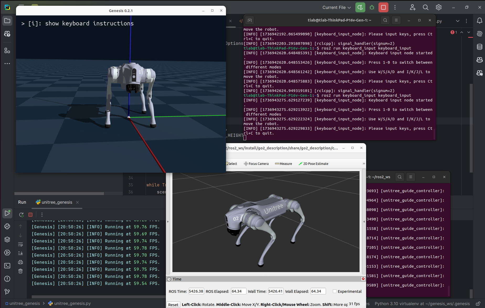

# Unitree Genesis
A genesis simulation based on [unitree_sdk_python](https://github.com/unitreerobotics/unitree_sdk2_python), but not only unitree robots.



* ROS2 Distrobox command
    ```bash
    distrobox create --name ubuntu22 --additional-flags "--runtime=nvidia -e NVIDIA_VISIBLE_DEVICES=all -e NVIDIA_DRIVER_CAPABILITIES=all" --image ubuntu:22.04 --home ~/distrobox/ubuntu22
    ```